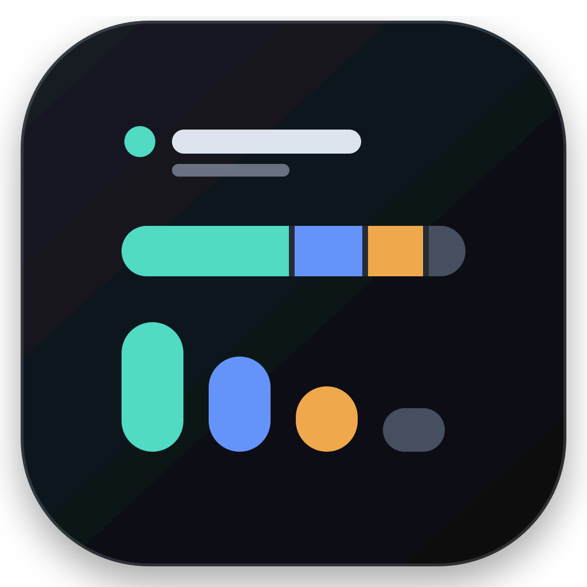
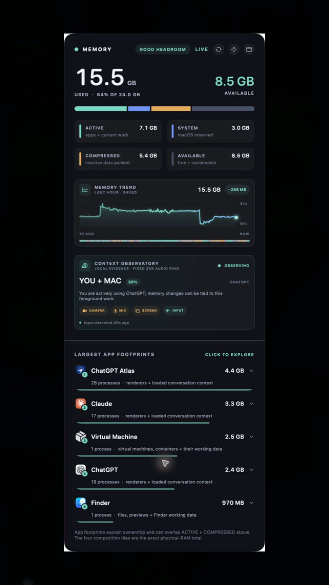

<p align="center">
  
</p>

<h1 align="center">Memory Widget</h1>

<p align="center">
  A visual, local-first RAM observatory for macOS—with a built-in MCP server for agents.
</p>

<p align="center">
  <a href="https://github.com/mrdewclau/memory-widget/actions/workflows/ci.yml"></a>
  <a href="https://github.com/mrdewclau/memory-widget/security"></a>
  <a href="LICENSE"></a>
  
</p>

<p align="center">
  <a href="docs/assets/memory-widget-overview.mp4">
    
  </a>
</p>

<p align="center">
  <a href="docs/assets/memory-widget-overview.mp4">Watch the 60-second narrated overview</a>
</p>

Memory Widget turns macOS memory into a glanceable visual model: what is physically in RAM, how much remains available, which apps own the largest footprints, why their helper processes exist, and how memory changed over time. It stays above normal windows, follows you across Spaces, and can collapse into a desktop widget or menu-bar popover.

## What it shows

| View | What it answers |
| --- | --- |
| Physical composition | How much RAM is active, wired to macOS, compressed, and available? |
| App footprints | Which applications and grouped helper processes own the largest footprints? |
| Provenance explorer | What launched a process, why does it exist, and how confident is that explanation? |
| Memory timeline | How has used RAM moved over the last hour, with a rolling 24-hour local history? |
| Context Observatory | Was the Mac being actively used, playing media, working alone, or sitting quiet? |
| MCP server | Can a local agent read the same live model without scraping the interface? |

## Install

The current release is for Apple Silicon Macs running macOS 14 or newer.

1. Download `Memory-Widget-*-macos-arm64.zip` from [Releases](https://github.com/mrdewclau/memory-widget/releases).
2. Unzip it and move `Memory Widget.app` to Applications.
3. Double-click the app.
4. Approve only the local context permissions you want to use.

The RAM monitor itself does not need camera, microphone, or Screen Recording permission. See [Privacy](PRIVACY.md) before enabling Context Observatory signals.

Release archives are reproducible ad-hoc-signed builds and are not Apple-notarized. macOS may require the standard first-launch confirmation for software downloaded outside the App Store. Building from source avoids downloading a prebuilt executable; notarized distribution requires a separate Developer ID release identity.

## Interaction

- Drag the widget background to place it anywhere.
- Use the header controls to switch between full, compact, and menu-bar-only modes.
- Click a footprint to hide the others and expand its source chain, purpose, runtime, confidence, and process roles.
- Click the expanded footprint again to restore the ranked list.
- Hover source and confidence elements for the evidence behind the explanation.

## Context Observatory

Context Observatory correlates RAM with local activity. It uses bounded collection and performs analysis with Apple frameworks on the Mac:

| Signal | Behavior |
| --- | --- |
| Input + foreground app | Sampled every five seconds. |
| Camera | Brief still at randomized intervals; capture session stops immediately afterward. |
| Microphone | Fixed 30-second, 16 kHz mono ring; short local classification bursts. |
| Screen | Disabled until an existing Screen Recording grant is silently verified. The app never opens System Settings. |
| CPU + audio-producing apps | Used to distinguish direct use from autonomous background work. |

Only one analysis helper runs at a time. Rich capture pauses under macOS memory pressure. Raw evidence is removed after seven days; derived history is stored as bounded local files. No analytics SDK is included. The only built-in network activity is Sparkle checking GitHub Releases for signed app updates.

## Updates

Memory Widget 2.2.0 and newer check the stable GitHub release feed once per day. Use the circular-arrow control in either the desktop header or menu-bar popover to check immediately. Discovery is automatic; downloading, installation, and relaunch remain user-confirmed.

Both the update feed and archive are signed with a dedicated Ed25519 key, and the archive is verified before extraction. Updating replaces only `Memory Widget.app`; history, evidence, MCP state, preferences, permission decisions, and window placement remain outside the bundle and are preserved. Existing 2.1.1 installations need one manual download of 2.2.0 because that older build does not contain an updater. See [Updater design and release runbook](docs/UPDATER.md).

## MCP access

The app bundle includes a local stdio MCP server with modern `2026-07-28` discovery and legacy `2025-11-25` initialization support.

```sh
./build_app.sh
./install_mcp.sh
```

Agents receive five tools—current snapshot, app footprints, RAM history, context, and open-widget—and three corresponding resources. The MCP process starts only when an agent launches it and exits when the stdio connection closes. It never opens a listening port. See [MCP server contract](MCP_SERVER.md).

## Build from source

Requirements:

- Apple Silicon Mac
- macOS 14+
- Xcode Command Line Tools with Swift

```sh
git clone https://github.com/mrdewclau/memory-widget.git
cd memory-widget
./build_app.sh
./test_mcp.sh
open "Memory Widget.app"
```

`build_app.sh` uses the first available Apple Development identity. Set `MEMORY_WIDGET_SIGNING_IDENTITY` to choose another identity, or set it to `-` for ad-hoc signing.

## Local data

```text
~/Library/Application Support/Memory Widget/
├── memory-history.json
├── mcp-live-state.json
└── Context Observatory/
    ├── context-YYYY-MM-DD.jsonl
    └── Evidence/
```

See [Architecture](docs/ARCHITECTURE.md), [Privacy](PRIVACY.md), [Security](SECURITY.md), and [Contributing](CONTRIBUTING.md).

## License

MIT © 2026 mrdewclau
